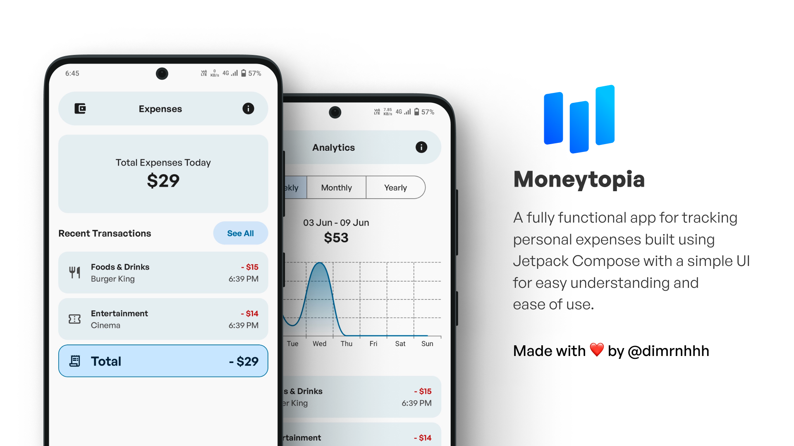
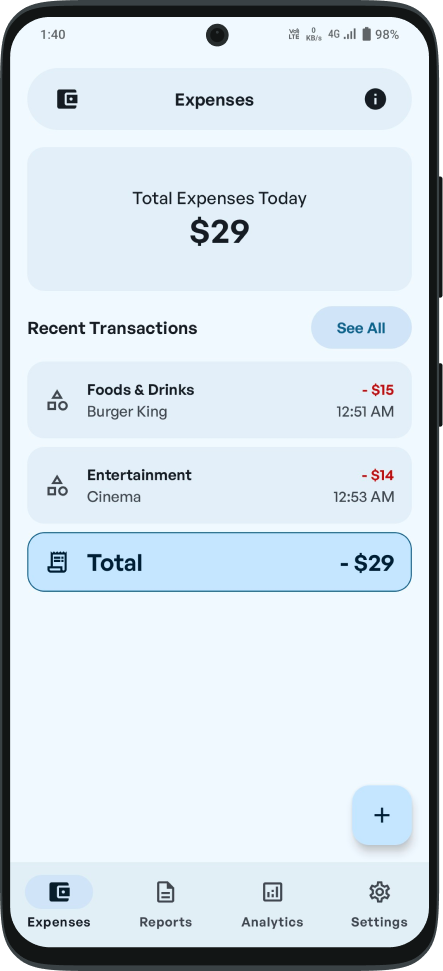
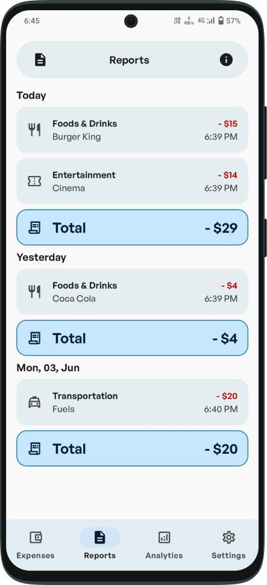
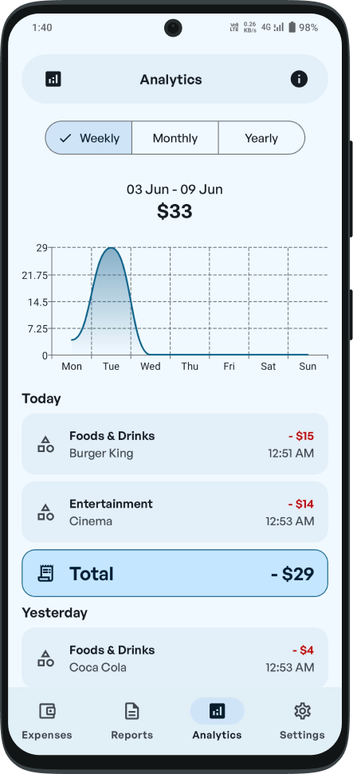
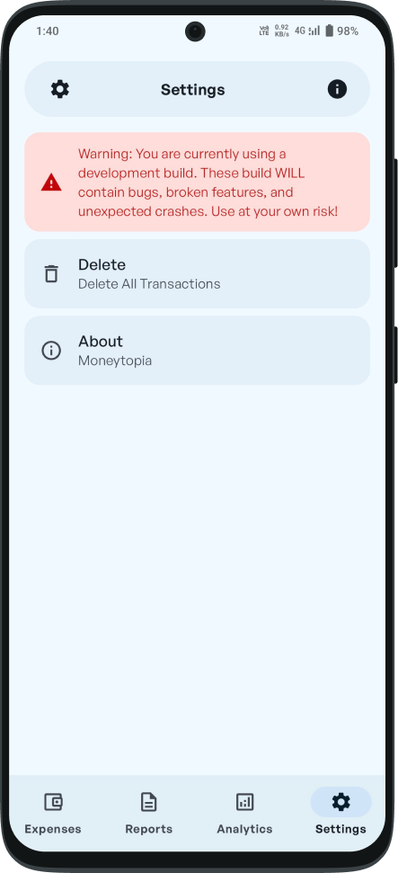
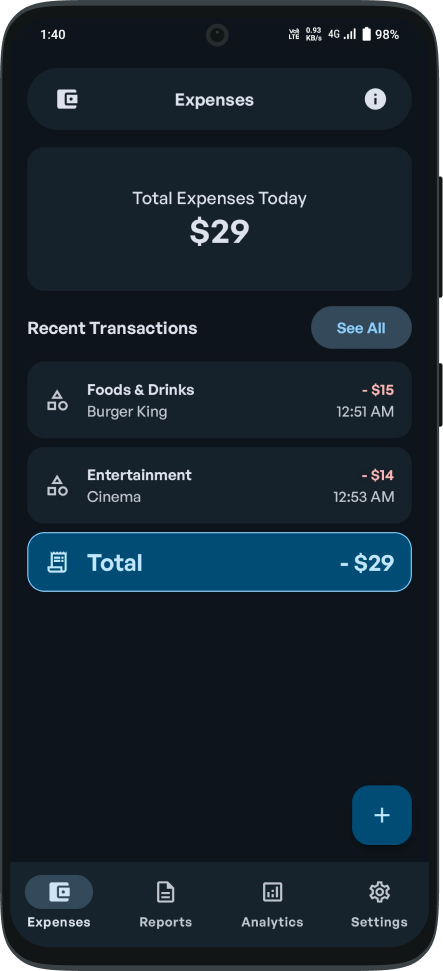
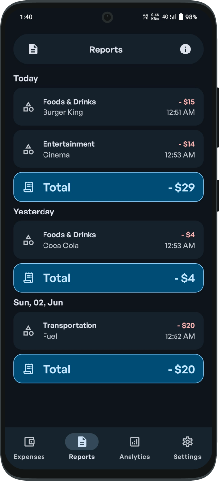
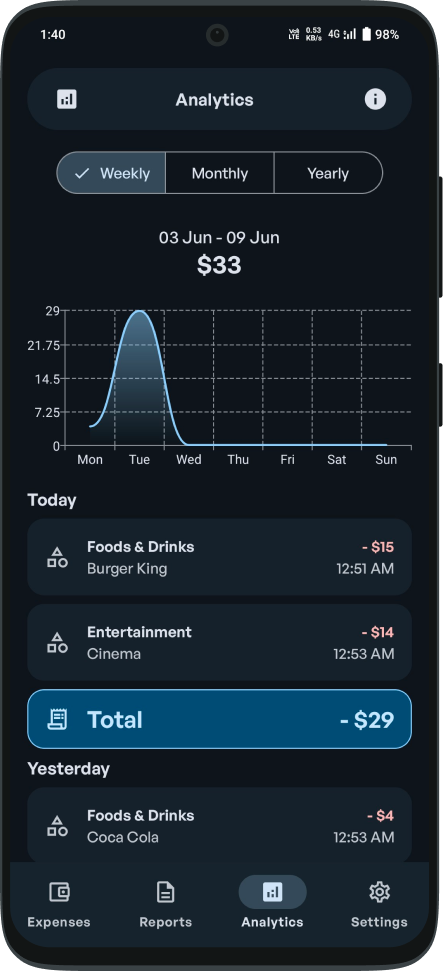
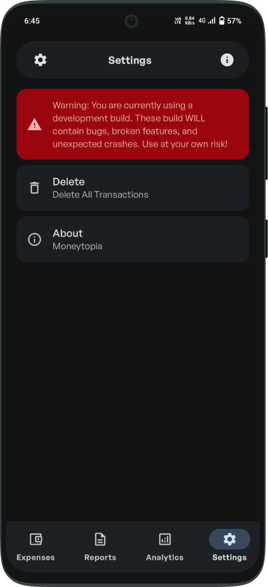

# Moneytopia
A fully functional app for tracking personal expenses built using Jetpack Compose with a simple UI for easy understanding and ease of use.
\
\

## Features
- Material 3 (Material You) UI with Dynamic Color
- Automatic light/dark mode
- Multi-language (currently available: en-US, id-ID)
- Recent transactions within the last 24 hours
- A report that contains all expenses
- Expenses in a line chart view
- Swipe-able action to display expenses from a certain period of time
- Delete all expense records or delete them one by one, and
- No unnecessary permissions needed to use this app

## Light Mode

    
    
    
    

## Dark Mode

    
    
    
    

## Requirements (Developers)
- Android Studio Ladybug | 2024.2.1
- Min SDK 28
- Target SDK 35
- AGP 8.7.0
- JDK 17
- Kotlin 2.0.21

## Dependencies (Developers)
- [Realm Kotlin](https://www.mongodb.com/docs/atlas/device-sdks/sdk/kotlin/install/)
- [Kotlinx Coroutines Core](https://mvnrepository.com/artifact/org.jetbrains.kotlinx/kotlinx-coroutines-core)
- [Compose Navigation](https://mvnrepository.com/artifact/androidx.navigation/navigation-compose)
- [Compose Compiler Gradle Plugin](https://mvnrepository.com/artifact/org.jetbrains.kotlin.plugin.compose/org.jetbrains.kotlin.plugin.compose.gradle.plugin)
- [Lifecycle ViewModel Compose](https://mvnrepository.com/artifact/androidx.lifecycle/lifecycle-viewmodel-compose)
- [AppCompat](https://mvnrepository.com/artifact/androidx.appcompat/appcompat)
- [Compose Material Icons Extended](https://mvnrepository.com/artifact/androidx.compose.material/material-icons-extended)
- [Vico Compose Chart](https://patrykandpatrick.com/vico/wiki/1.14.0/getting-started)
