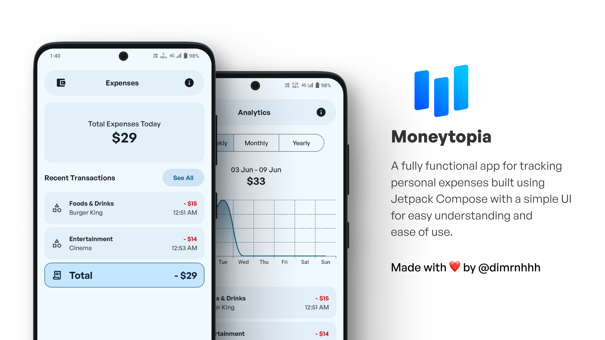
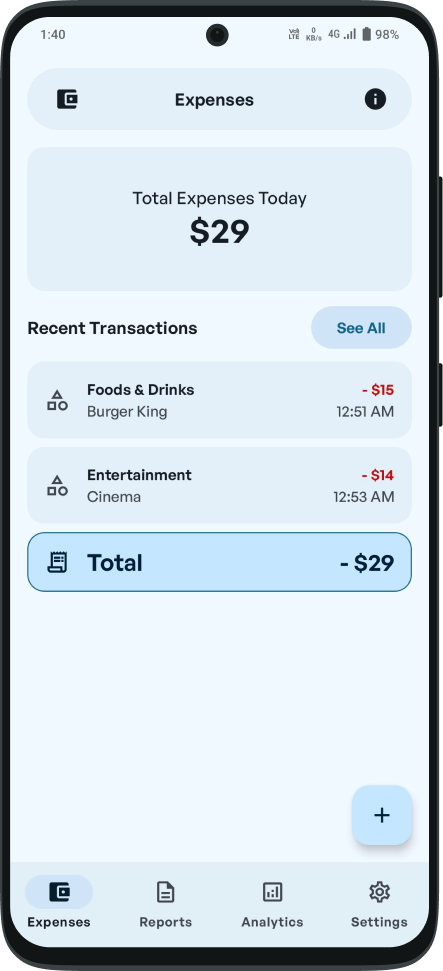
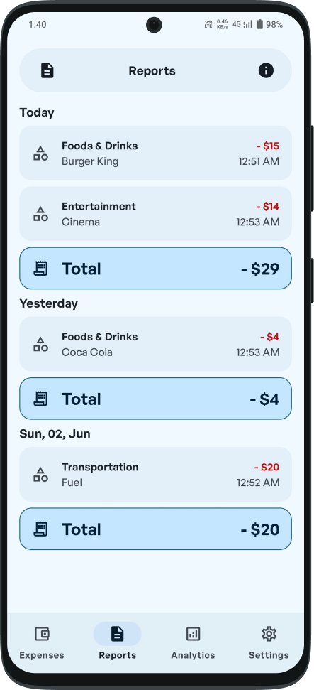
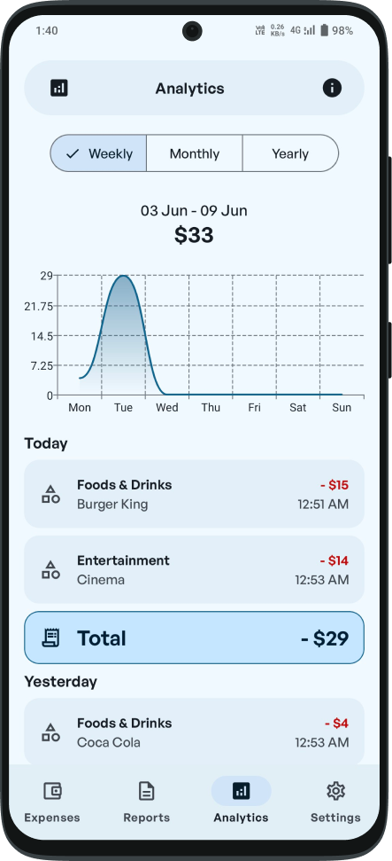
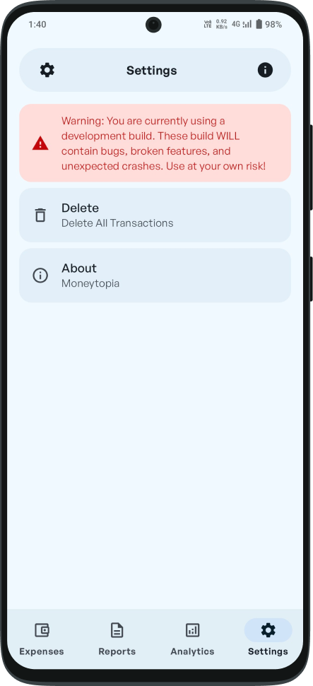
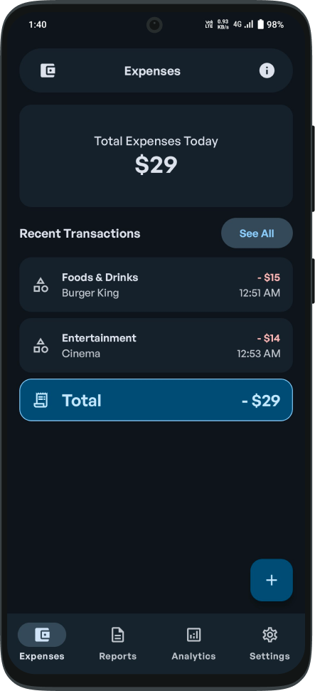
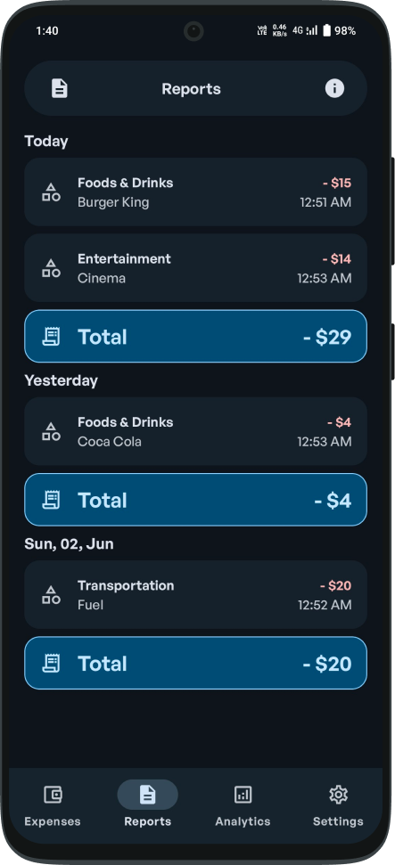
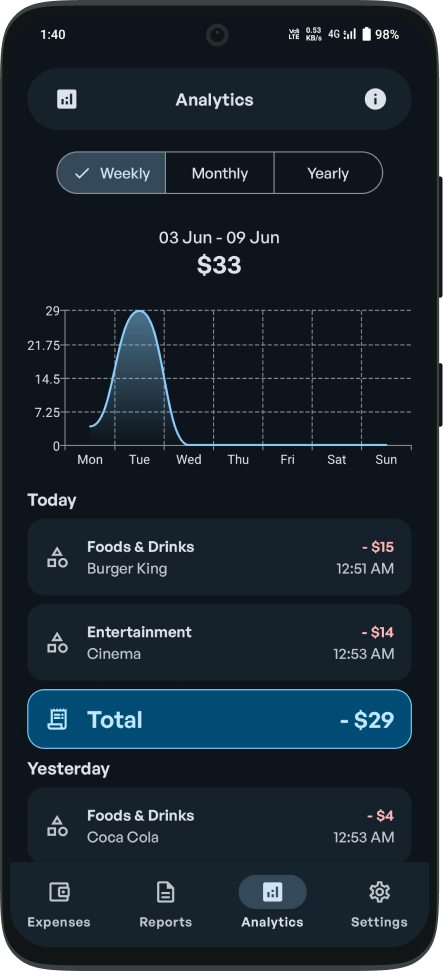
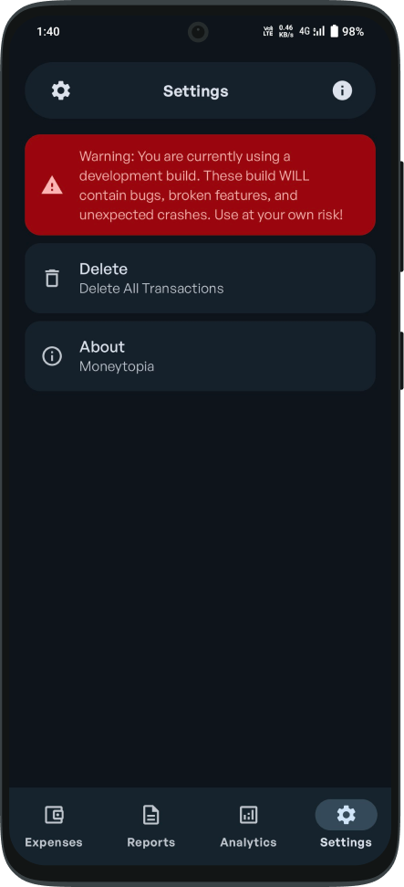

# Moneytopia
A fully functional app for tracking personal expenses built using Jetpack Compose with a simple UI for easy understanding and ease of use.

## Features
- Recent transactions within the last 24 hours
- A report that contains all expenses
- Expenses in a line chart view
- Swipe able action to display expenses from a certain period of time
- Delete all expense records or delete them one by one

## Light Mode
   

## Dark Mode
   